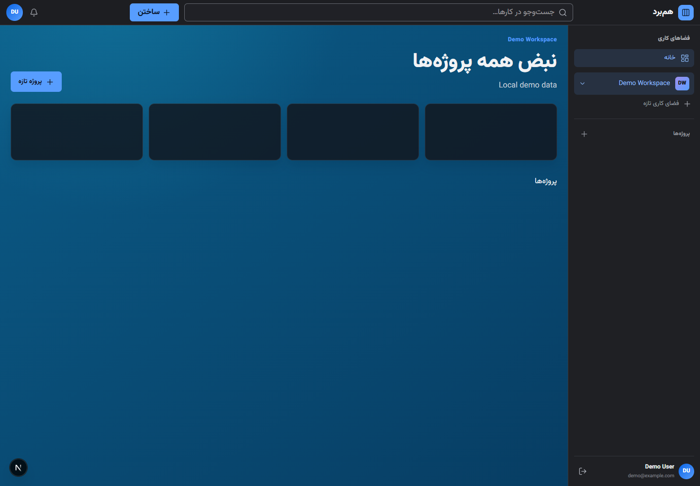

# Persian Project Manager

> A modern, right-to-left project workspace for turning ideas into visible, collaborative progress.

**[Open the live application](https://persian-project-manager.vercel.app)** · **[View the source](https://github.com/amirrezabagherzadeh/Project-Manager)**

## Overview

Persian Project Manager is a full-stack project-management application designed for Persian-speaking teams. It combines a polished RTL interface with a secure FastAPI backend, giving teams a focused place to organize workspaces, projects, boards, tasks, people, and progress.

The product is built as two independent services: a Next.js web app for the experience and a FastAPI service for authentication, collaboration, and data access. In production, Vercel Services routes both behind one public application.

## Product experience

### UI/UX principles

- **RTL by design.** Persian language, directionality, navigation alignment, and keyboard behavior are first-class rather than retrofitted.
- **A clear project hierarchy.** Workspaces, projects, board columns, and task details are progressively revealed so users always know where they are.
- **Fast visual scanning.** The dashboard uses concise cards, resilient empty states, clear hierarchy, and high-contrast controls to make status easy to read.
- **Responsive navigation.** Desktop users work from a persistent right-side workspace rail; mobile users receive an accessible sheet-based navigation pattern.
- **Focused task work.** Cards open into a dedicated detail surface for descriptions, subtasks, labels, assignees, comments, checklists, attachments, and activity.
- **Comfortable theming.** Light and dark themes persist across sessions.

### What is included

- Email/password registration, OAuth2-style login, refresh-token rotation, logout, and profile management
- Workspace ownership, invitations, membership, and role-based access control
- Private or shared projects with default Kanban columns and atomic column reordering
- Tasks, subtasks, priority, due dates, labels, assignees, archiving, and versioned moves
- Checklists, comments, file attachments, and task activity
- Project and global dashboards, timeline/calendar reporting, and notifications
- A development-only demo account for a fast local walkthrough

## Architecture

\`\`\`mermaid
flowchart LR
    U[Browser] -->|RTL web experience| F[Next.js 16 frontend]
    F -->|/backend rewrite| A[FastAPI service]
    A --> S[Auth + RBAC + domain services]
    S --> D[(SQLite locally / managed Postgres in production)]
    S --> T[Private attachment storage]
    V[Vercel Services] --> F
    V --> A
\`\`\`

| Layer | Technology | Responsibility |
| --- | --- | --- |
| Frontend | Next.js 16, React 19, TypeScript, Tailwind CSS | Responsive Persian UI, client state, and accessible interactions |
| Backend | FastAPI, SQLAlchemy async, Alembic | REST API, validation, authorization, migrations, and domain workflows |
| Data | SQLite for local development; managed Postgres in production | Durable application data |
| Deployment | Vercel Services | Unified frontend/backend routing and GitHub-driven releases |
| Testing | Vitest, Playwright, Pytest | Component, browser, API, and integration coverage |

## Local development

### Prerequisites

- Node.js 20.9+
- pnpm 10+
- Python 3.12+
- [uv](https://docs.astral.sh/uv/)

### 1. Start the API

\`\`\`powershell
Copy-Item backend/.env.example backend/.env
Set-Location backend
$env:PYTHONUTF8 = "1"
uv sync
New-Item -ItemType Directory -Force storage
uv run alembic upgrade head
uv run ppm-seed
uv run fastapi dev app/main.py
\`\`\`

The API is then available at \`http://127.0.0.1:8000\`, with interactive documentation at \`/docs\`.

### 2. Start the web app

In a second terminal:

\`\`\`powershell
Copy-Item frontend/.env.example frontend/.env.local
Set-Location frontend
pnpm install
pnpm dev
\`\`\`

Open \`http://127.0.0.1:3000\`.

### Demo account

Run \`uv run ppm-seed\` in the \`backend\` directory, then choose **"ورود با حساب نمونه"** in the UI or use:

\`\`\`text
Email:    demo@example.com
Password: demo-password-change-me
\`\`\`

The seed command is intentionally disabled in production.

## Quality checks

\`\`\`powershell
# Backend
Set-Location backend
uv run ruff check .
uv run ruff format --check .
uv run mypy app
uv run pytest

# Frontend
Set-Location ../frontend
pnpm lint
pnpm test
pnpm build
pnpm e2e
\`\`\`

Playwright uses the installed Chrome channel. If needed, install its bundled browser with \`pnpm exec playwright install chromium\`.

## Deployment

The repository is connected to Vercel. Every push to \`main\` creates a production deployment of the Services configuration in [\`vercel.json\`](vercel.json).

The public deployment is available at **[persian-project-manager.vercel.app](https://persian-project-manager.vercel.app)**. The GitHub repository homepage is set to the same URL.

For a manual production deployment:

\`\`\`powershell
vercel --prod
\`\`\`

Production requires a managed database connection and secure values for \`APP_SECRET_KEY\`, cookie settings, allowed origins, and storage configuration. Never commit real environment files or credentials.

## Repository layout

\`\`\`text
backend/       FastAPI application, migrations, tests, and storage adapters
frontend/      Next.js application, UI components, browser tests, and API client
docs/images/   Product screenshots used in this documentation
openspec/      Product and implementation specifications
vercel.json    Vercel Services routing for the web app and API
\`\`\`

## Security notes

The backend enforces explicit origin allowlists, short-lived access tokens, rotating opaque refresh sessions, resource-level authorization, role-based access control, and safe handling of attachment uploads. Local defaults are for development only; production secrets and database URLs must be configured in Vercel environment variables.
