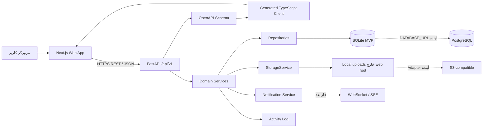

# معماری سامانه

## نمای کلان

نسخهٔ اول یک Modular Monolith است: یک API مستقل FastAPI و یک Web App مستقل Next.js، با Domain moduleهای روشن و قرارداد REST/OpenAPI.



## مرزهای Domain

- Identity: User، Profile، RefreshSession
- Workspace: Workspace، Membership، Invitation، RBAC
- Project: Project، ProjectMember، BoardColumn
- Task: Task، Assignee، Label، Checklist، Subtask
- Collaboration: Comment، Attachment، Activity
- Engagement: Notification و due reminder
- Reporting: Global/Project Dashboard، Overview، Timeline، Calendar

هر Domain مسیرهای Model، Schema، Repository و Service خود را دارد. وابستگی میان Domainها از Service contract عبور می‌کند، نه Import پراکندهٔ Repository.

## ساختار هدف

```text
backend/
  app/
    api/{deps,error_handlers,v1/}
    core/{config,database,security,permissions,logging,constants}
    models/ schemas/ repositories/ services/
    storage/{base,local}
    jobs/ utils/ seed.py main.py
  migrations/ storage/uploads/ tests/{unit,integration}
frontend/
  src/
    app/{(auth),(app)}
    components/{ui,layout,workspace,project,board,task,dashboard}
    features/{auth,workspaces,projects,tasks,notifications}
    lib/{api,auth,dates,permissions,query-client}
    hooks/ providers/ messages/fa.ts types/
  e2e/ public/
openspec/
  config.yaml
  changes/
  specs/
docs/
```

## مدل نقش

Roleهای Workspace: `OWNER`, `ADMIN`, `PROJECT_MANAGER`, `MEMBER`.

- Owner: همهٔ عملیات، حذف Workspace و انتقال Ownership
- Admin: مدیریت Workspace و اعضا به‌جز Owner
- Project Manager: ایجاد Project و مدیریت Projectهای تحت مسئولیت
- Member: Task در Project عضو؛ ویرایش محدود به Task ساخته‌شده یا Assigned؛ بدون تنظیمات و Role

Project membership دارای `manager/member` است و مستقل از Workspace role، دسترسی Project خصوصی را محدود می‌کند.

## مدل دادهٔ اصلی

- `User` 1—N `WorkspaceMember`; `Workspace` 1—N `Project`
- `Project` 1—N `BoardColumn` و 1—N `Task`
- `Task` self-reference برای Subtask
- Task N—M User از `TaskAssignee`
- Task N—M Label از `TaskLabel`
- Task 1—N Checklist/Comment/Attachment
- User 1—N Notification؛ Workspace/Project/Task 1—N ActivityLog

Constraintهای مهم:

- `workspace_member(workspace_id,user_id)` unique
- `project(workspace_id,key)` unique
- `project_member(project_id,user_id)` unique
- `task_assignee(task_id,user_id)` unique
- `label(project_id,name)` unique
- Parent Task باید در همان Project باشد.

پنج ستون پیش‌فرض Project: بک‌لاگ، برای انجام، در حال انجام، بازبینی، انجام‌شده؛ فقط ستون آخر `is_done=true`.

## سازگاری و Consistency

- قرارگرفتن Task در ستون Done منبع حقیقت Completion است و `completed_at` را همگام می‌کند.
- Move با `version`, `target_column_id`, `target_index` انجام می‌شود؛ Conflict پاسخ `409` است.
- Positionهای Source/Target در یک Transaction بازنویسی می‌شوند.
- Overdue یعنی `due_at < now` و Task کامل نشده؛ Due soon یعنی هفت روز آینده.
- `completion_rate` برای مجموعهٔ خالی صفر است.

## Auth flow

1. `/auth/token` با OAuth2 password form، Access Token برمی‌گرداند و Refresh Cookie تنظیم می‌کند.
2. Frontend Access Token را در Memory نگه می‌دارد.
3. پس از reload، `/auth/refresh` یک Access جدید می‌دهد.
4. تنها یک retry متمرکز انجام می‌شود؛ شکست Refresh، state را پاک و به Login هدایت می‌کند.
5. Swagger از OAuth2 Password Flow و Authorize پشتیبانی می‌کند.

## Storage و Notification

`StorageService` سه قابلیت `save/open/delete` دارد. Local adapter فقط انتخاب MVP است. Metadata حذف‌شده soft-delete و cleanup فیزیکی کنترل‌شده است.

Notification برای membership، assignment، comment/mention، due/overdue و رویداد مهم ساخته می‌شود. عامل نباید برای عمل خود اعلان بگیرد؛ Drag پرتکرار نباید spam بسازد؛ Reminder با logical unique key deduplicate می‌شود. Job آینده:

```bash
uv run python -m app.jobs.generate_due_notifications
```

## تصمیم‌های آینده‌پذیر

خارج از MVP: real-time collaboration، chat/calls، automation builder، advanced custom fields/time tracking، billing، guest/SSO/LDAP، native mobile، advanced Gantt dependencies، recurring tasks، real email/push، public API/webhook/plugin marketplace و offline-first.

معماری باید Adapter و Domain boundary لازم را حفظ کند، اما این موارد نباید MVP را تأخیر بیندازند.
